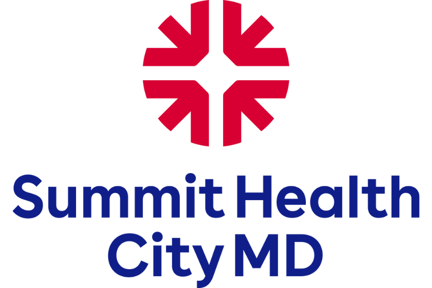
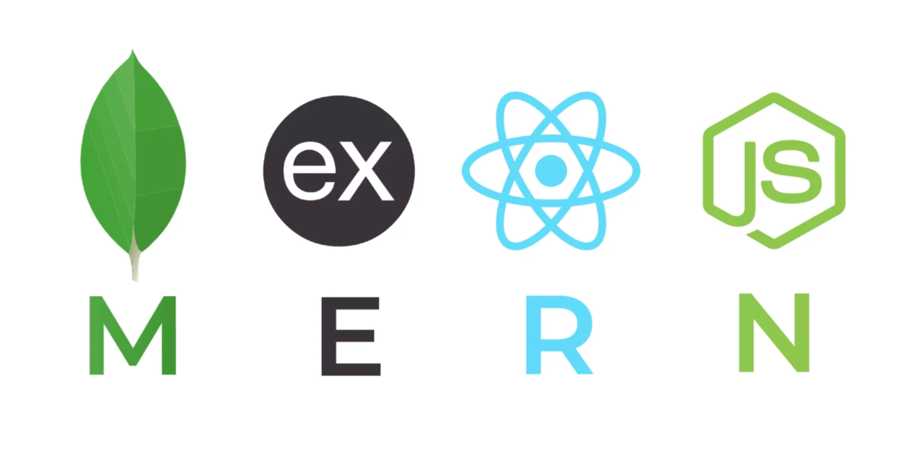

<h1 align="center">Patient Chart: 👩‍💻 Loren Franco</h1>

| Demographics                 | Patient Info                                                                                                                                                                                                                                                                                                                                                                                                                                                                            |
| ---------------------------- | --------------------------------------------------------------------------------------------------------------------------------------------------------------------------------------------------------------------------------------------------------------------------------------------------------------------------------------------------------------------------------------------------------------------------------------------------------------------------------------- |
| **Name**                     | Loren Franco                                                                                                                                                                                                                                                                                                                                                                                                                                                                            |
| **DOB  (Dev OnBoarding)** | June 2023 (Started Coding)                                                                                                                                                                                                                                                                                                                                                                                                                                                              |
| **Location**                 | 📍New Jersey                                                                                                                                                                                                                                                                                                                                                                                                                                                                            |
| **Occupation**               | Clinical Informatics Analyst @ <a href="https://www.summithealth.com/about-us">Summit Health CityMD</a>                                                                                                                                                                                                                                                                                                                                                                                                                                     |
| **Primary Concern**          | Full-Stack Fluency                                                                                                                                                                                                                                                                                                                                                                                                                                                                |
| **Languages Spoken**         |      |
| **Currently Learning**                |       
| 🩺 **Past Medical (Project) History** | 
 
 Projects
 📊 Analytics Dashboard for Google Fiber Capstone Project <a href="https://www.linkedin.com/in/loren-franco/details/certifications/277342974/multiple-media-viewer?profileId=ACoAAB_zXPYBXF7YpXzKKkZGqTaeGng7MqNC0Rc&treasuryMediaId=1714090092930&type=DOCUMENT&lipi=urn%3Ali%3Apage%3Ad_flagship3_profile_view_base_certifications_details%3BhNe5gweZR4qen3Ae5SR%2FAg%3D%3D">Executive Summary</a> & <a href="https://public.tableau.com/views/GoogleBICapstone_GoogleFiber/RepeatCallsDashboard?:language=en-US&:sid=&:redirect=auth&:display_count=n&:origin=viz_share_link">Tableau Dashboard</a>  🖥️ <a href="https://lorenfranco.github.io">Personal Portfolio Website </a> – Full-stack build in progress 
 
| **Allergies**                | 🍝 Eggplant parmesan & 🦀 Soft Shell Crab    **Reactivity**: Moderate   **Criticality**: Severe     
| **Care Plan (Learning & Goals)**                | - 🚀 End of 2025: Graduate from Codecademy's Full Stack Developer Bootcamp - 📚 Personal Project: Finalize build on a Staff-Facing, Patient Check-In Website                                                                                                                                                                                                                                     